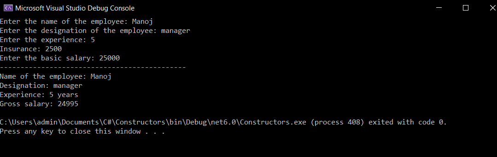

# Constructor

## Aim:
To write a C# program to calculate the salary of an employee by passing the name, designation, years of experience, basic salary and insurance amount through constructor.

## Algorithm:
### Step 1:
Create a new Class named employee.
### Step 2:
Create a constructor
### Step 3:
Create two methods one is Salary & other is Display
### Step 4:
Create a main function and get name, designation, experience, basic salary and insurance amount from the User.
### Step 5:
Create a object and pass the input as parameters
### Step 6:
Call the salary method to calculate the salary
### Step 7:
Call the display method to display the details
### Step 8:
End of the Program.

## Program:
```
Name: Paul Andrew D
Reg.no: 212221230075
```
```C#
using System;
namespace sample { 
class employee
{
    string name;
    string designation;
    int basic_salary;
    int experience;
    int insurance;
    float gross_salary;
    float hra, da;
    public employee(string name, string designation, int basic_salary, int experience, int insurance)
    {
        this.name = name;
        this.designation = designation;
        this.basic_salary = basic_salary;
        this.experience = experience;
        this.insurance = insurance;
        salary(basic_salary, experience);
        display();

    }
    public void salary(int basic_salary, int insurance)
    {

        hra = (20 / 100) * basic_salary;
        da = (10 / 100) * basic_salary;
        gross_salary = basic_salary + hra + da - insurance;

    }
    void display()
    {
        Console.WriteLine("Name of the employee: " + this.name);
        Console.WriteLine("Designation: " + this.designation);
        Console.WriteLine("Experience: " + this.experience + " years");
        Console.WriteLine("Gross salary: " + gross_salary);

    }
}
    class program
    {
        public static void Main(string[] args)
        {
            int basic_salary;
            int experience;
            int insurance;
            string name,designation;
            Console.Write("Enter the name of the employee: ");
            name = Console.ReadLine();
            Console.Write("Enter the designation of the employee: ");
            designation = Console.ReadLine();
            Console.Write("Enter the experience: ");
            experience = Convert.ToInt32(Console.ReadLine());
            Console.Write("Insurance: ");
            insurance = Convert.ToInt32(Console.ReadLine());
            Console.Write("Enter the basic salary: ");
            basic_salary = Convert.ToInt32(Console.ReadLine());
            Console.WriteLine("---------------------------------------------");
            employee emp = new employee(name,designation, basic_salary,experience, insurance);
        }
    }
}


 ```
 ## Output:

 
 ## Result:
 Hence, a C# program to calculate the salary of an employee by passing the name, designation, years of experience, basic salary and insurance amount through constructor is executed successfully
